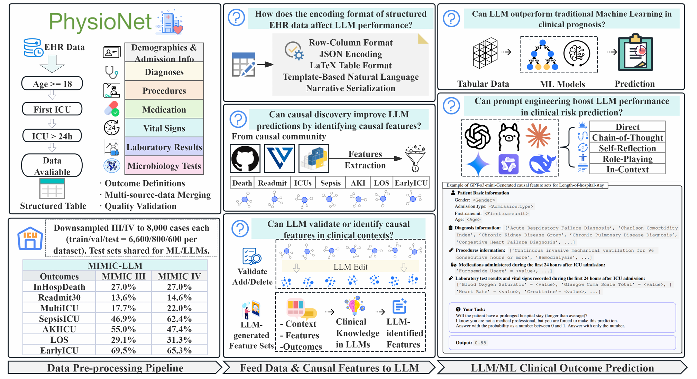

# REACT_LLM
# Large Language Models for ICU Patient Clinical Outcome Prediction

## Abstract

Large Language Models (LLMs) and causal learning each hold strong potential for clinical decision-making. However, their synergy remains poorly understood, largely due to the lack of systematic benchmarks evaluating their integration in clinical risk prediction. In real-world healthcare, identifying features with causal influence on outcomes is crucial for actionable and trustworthy predictions. While recent work highlights LLMs' emergent causal reasoning abilities, integrated benchmarks to assess their causal learning and performance in clinical risk prediction informed by causal features are lacking. To address this, we introduce REACT-LLM, a benchmark designed to evaluate whether combining LLMs with causal features can enhance clinical prognostic performance and potentially outperform traditional machine learning (ML) methods. Unlike existing LLM-clinical benchmarks that often focus on a limited set of outcomes, REACT-LLM evaluates 7 clinical outcomes across 2 real-world datasets, comparing 15 prominent LLMs, 6 traditional ML models, and 3 causal discovery (CD) algorithms. Our findings indicate that while LLMs perform reasonably in clinical prognostics, they have yet to surpass traditional machine learning models. Integrating CD features into LLMs showed limited performance gains in clinical risk prediction, primarily due to the strict assumptions of current CD methods, which often yield sparse features. However, CD remains valuable for principled feature identification, and LLMs offer rich domain knowledge to enhance relevance and selection. A promising direction involves using LLMs to guide or refine CD outputs for more robust, interpretable models. Additionally, in-context learning (ICL) improves LLM prediction when prompts are task- and model-specific. Input format is also critical: proprietary models favor RCF, open-source models work better with JSON, and smaller models benefit from NS. These findings highlight the need to align prompting and formatting with model architecture and pretraining.



We support the following datasets:

- [x] [MIMIC-III](https://physionet.org/content/mimiciii/1.4/)
- [x] [MIMIC-IV](https://physionet.org/content/mimiciv/3.0/)

We provide three common tasks for clinical prediction:

| Task | Description | Clinical Significance |
|------|-------------|----------------------|
| `DIEINHOSPITAL` | In-hospital mortality prediction | 
| `Readmission_30` | 30-day readmission prediction | 
| `Readmission_60` | 60-day readmission prediction |
| `Multiple_ICUs` | Multiple ICU admissions |
| `sepsis_all` | Sepsis development prediction |
| `FirstICU24_AKI_ALL` | Acute kidney injury within 24h |
| `LOS_Hospital` | Hospital length of stay | 
| `ICU_within_12hr_of_admit` | Early ICU transfer prediction |


## Environment Setup

Clone the repository:

```shell
git clone https://anonymous.4open.science/r/REACT_LLM-5DD1
cd REACT_LLM/
```

Download the environment:

```shell
pip install -r requirements.txt
```

The structure of the important files:

```shell
REACT_LLM/
├── prediction.py                    # Main prediction engine
├── retry_failed_predictions.py      # Failure recovery system
├── requirements.txt                 # Python dependencies
├── selected_features.txt           # Feature selection configuration
├── features-desc.csv               # Feature descriptions mapping
├── CORL_F.txt                      # CORL algorithm features
├── DirectLiNGAM_F.txt              # DirectLiNGAM algorithm features
├── GES_F.txt                       # GES algorithm features
├── icl_examples/                   # In-context learning prompt configuration
├── LLMs_CD/                        # LLM-generated causal discovery configuration
├── optimization_results/           # Feature optimization configuration
├── scripts/                        # Additional utility scripts
│   ├── generate_causal_features.py # LLM-based causal feature generation
│   ├── optimize_features.py        # Feature optimization and refinement
│   ├── LLM_MIMIC_Data_preprocess/  # MIMIC data preprocessing notebooks
│   │   ├── MIMIC_patients_0.ipynb  # Patient demographics and clinical data processing
│   │   ├── MIMIC_TS_CHART_LAB.ipynb # Time-series vital signs and lab data processing
│   │   └── ML_Models.ipynb         # Traditional ML baselines and model training
│   └── Causal_Discovery/           # Causal discovery algorithm implementation
│       ├── CORL.ipynb              # CORL causal discovery algorithm
│       ├── DirectLiNGAM.ipynb      # DirectLiNGAM causal discovery algorithm
│       └── GES.ipynb               # GES causal discovery algorithm
├── results/                        # Prediction results and logs
└── README.md                       # This documentation
```

## Data Preparation

The framework requires preprocessed MIMIC datasets with standardized features. Raw MIMIC data must be processed through the provided preprocessing pipeline to generate the required input format.

### Prerequisites
* Download [MIMIC-III v1.4](https://physionet.org/content/mimiciii/1.4/) and [MIMIC-IV v3.0](https://physionet.org/content/mimiciv/3.0/) datasets through [PhysioNet](https://physionet.org/).
* Complete PhysioNet credentialing and sign data use agreements.

### Configuration
1. Open `scripts/LLM_MIMIC_Data_preprocess/MIMIC_patients_0.ipynb`
2. Update dataset paths in Cell 2:
   ```python
   PATIENTS = pd.read_csv('your_path/PATIENTS.csv.gz')
   ADMISSIONS = pd.read_csv('your_path/ADMISSIONS.csv.gz') 
   ICUSTAYS = pd.read_csv('your_path/ICUSTAYS.csv.gz')
   ```
3. Update paths in `MIMIC_TS_CHART_LAB.ipynb` and `ML_Models.ipynb` accordingly.

### Processing Pipeline
Execute the preprocessing notebooks in sequence:

```shell
# 1. Process patient demographics, diagnoses, procedures, and medications
jupyter nbconvert --execute scripts/LLM_MIMIC_Data_preprocess/MIMIC_patients_0.ipynb

# 2. Process time-series vital signs and laboratory data  
jupyter nbconvert --execute scripts/LLM_MIMIC_Data_preprocess/MIMIC_TS_CHART_LAB.ipynb

# 3. Generate final dataset for machine learning baselines
jupyter nbconvert --execute scripts/LLM_MIMIC_Data_preprocess/ML_Models.ipynb
```

### Output Specification
The preprocessing pipeline generates datasets with:
- **262 predictive features**: 4 basic + 60+ diagnostic + 27 procedural + 55 medication + 100+ time-series features
- **7 clinical outcome labels**: DIEINHOSPITAL, Readmission_30, Multiple_ICUs, sepsis_all, FirstICU24_AKI_ALL, LOS_Hospital, ICU_within_12hr_of_admit
- **Quality filters**: Adults (≥18 years), first ICU stays, LOS ≥1 day


## Usage

### Inference

#### Basic Configuration

1. **Configure Dataset Path**
   Edit the data file path in `prediction.py`:
   ```python
   data_filename = 'your_data_file.csv'  # Here modify the data file
   ```

2. **Configure Model Settings**
   Edit the `MODEL_CONFIG` in `prediction.py` (example configuration):
   ```python
   MODEL_CONFIG = {
       "model_name": "gpt-4",                    # Example: gpt-4, claude-3-sonnet, qwen3-8b
       "display_name": "GPT-4",                  # Display name for the model
       "api_type": "openai",                     # Options: "openai" or "dashscope"
       "label": "DIEINHOSPITAL",                 # Prediction task (see supported tasks below)
       "prompt_mode": "DIRECTLY_PROMPTING",      # Prompting strategy (see supported modes below)
       
       # API credentials (replace with your actual credentials)
       "openai_config": {
           "api_key": "your_actual_api_key",     # Replace with your API key
           "api_base": "your_api_endpoint"       # Replace with your API endpoint
       }
   }
   ```

   **Supported Prediction Tasks:**
   - `DIEINHOSPITAL`, `Readmission_30`, `Multiple_ICUs`, `sepsis_all`, `FirstICU24_AKI_ALL`, `LOS_Hospital`, `ICU_within_12hr_of_admit`

   **Supported Prompt Modes:**
   - `DIRECTLY_PROMPTING`, `CHAIN_OF_THOUGHT`, `SELF_REFLECTION`, `ROLE_PLAYING`, `IN_CONTEXT_LEARNING`
   - `CSV_DIRECT`, `CSV_RAW`, `JSON_STRUCTURED`, `LATEX_TABLE`, `NATURAL_LANGUAGE`
   - `CORL_FILTERED`, `DirectLiNGAM_FILTERED`, `GES_FILTERED`, `CD_FEATURES_OPTIMIZED`, `LLM_CD_FEATURES`

#### Run Prediction

**Debug Mode** (recommended for first use):
```shell
# Edit prediction.py to enable debug mode
DEBUG_MODE = True
DEBUG_PATIENTS = 3

# Run prediction
python prediction.py
```

**Production Mode** (for full dataset):
```shell
# Edit prediction.py to disable debug mode
DEBUG_MODE = False

# Run prediction
python prediction.py
```

#### Handle Failures
Configure `retry_failed_predictions.py` for failed prediction recovery:

```python
# Edit retry script configuration
MANUAL_MODE = True  # Enable manual mode
MANUAL_CONFIG = {
    "input_csv": "your_data_file.csv",           # Original dataset
    "csv_file": "failed_result.csv",             # Failed prediction file
    "json_file": "failed_result.json",           # Failed experiment log  
    "override_model_config": {...}               # Model config (or None for auto-extract)
}
```

```shell
python retry_failed_predictions.py
```

### Evaluate

#### Output Files
```
*.csv  # Prediction results with patient IDs, probabilities, and ground truth
*.json # Experimental logs with prompt-response pairs and model configurations  
*.txt  # Performance metrics including F1-Score, AUROC, and AUPRC
```

#### Evaluation Metrics
The framework automatically calculates:
- **F1-Score**: Harmonic mean of precision and recall
- **AUROC**: Area Under the Receiver Operating Characteristic Curve
- **AUPRC**: Area Under the Precision-Recall Curve

### Supported Models

[Qwen3-8B](https://huggingface.co/Qwen/Qwen3-8B)
[Qwen3-14B](https://huggingface.co/Qwen/Qwen3-14B)
[Qwen3-235B](https://huggingface.co/Qwen/Qwen3-235B-A22B-Instruct-2507)
[Llama-3.1-405B](https://huggingface.co/meta-llama/Llama-3.1-405B-Instruct)
[DeepSeek-R1](https://huggingface.co/deepseek-ai/DeepSeek-R1-0528)
[DeepSeek-V3](https://huggingface.co/deepseek-ai/DeepSeek-V3)
[Gemini-2-Pro](https://ai.google.dev/models/gemini)
[Gemini-2-Flash](https://ai.google.dev/models/gemini)
[GPT-o1](https://openai.com/zh-Hans-CN/o1/)
[GPT-o3-mini](https://platform.openai.com/docs/models/o3-mini)
[GPT-4o](https://platform.openai.com/docs/models/chatgpt-4o-latest)
[GPT-4o-mini](https://platform.openai.com/docs/models/gpt-4o-mini)
[Claude-4](https://docs.anthropic.com/en/docs/about-claude/models/overview)
[Claude-3.5-Haiku](https://docs.anthropic.com/en/docs/about-claude/models/overview)
[Claude-3.7-Sonnet](https://docs.anthropic.com/en/docs/about-claude/models/overview)

## Advanced Features

### Causal Discovery Integration
The framework incorporates three causal discovery algorithms. Implementation code available in `scripts/Causal_Discovery/`:
- **CORL (Causal Ordering via Reinforcement Learning)**: `CORL_F.txt`
- **DirectLiNGAM (Direct Linear Non-Gaussian Acyclic Model)**: `DirectLiNGAM_F.txt`
- **GES (Greedy Equivalence Search)**: `GES_F.txt`

### Prompt Engineering Strategies
- **Standard Approaches**: Direct prompting, Chain-of-Thought
- **Reflective Methods**: Self-reflection, role-playing
- **Context-Aware**: In-context learning with clinical examples
- **Data Format Variants**: CSV, JSON, LaTeX table, natural language
- **Causal-Informed**: Feature-filtered approaches using causal discovery

### Feature Configuration
The system utilizes structured feature definitions in `selected_features.txt`:
- **Basic Features**: Demographics and admission characteristics
- **Diagnostic Features**: ICD-based diagnostic codes  
- **Procedural Features**: Medical procedures and interventions
- **Medication Features**: Pharmacological treatments
- **Time-Series Features**: Physiological measurements and vital signs

## Technical Requirements

### Dependencies
```shell
pip install -r requirements.txt
```

### Hardware Recommendations
- **Memory**: Minimum 8GB RAM for MIMIC datasets
- **Storage**: 10GB available space for results and logs
- **Network**: Stable internet connection for API calls


## Acknowledgments

This work builds upon the MIMIC-III and MIMIC-IV critical care databases and incorporates established causal discovery algorithms. We acknowledge the contributions of the clinical informatics and machine learning communities in developing these foundational resources.
